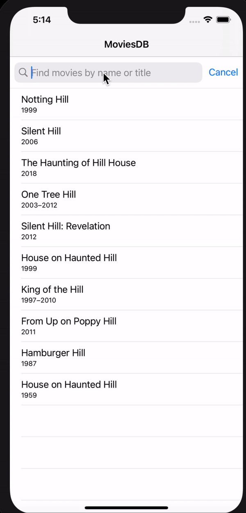

# MoviesDB
<a href="https://developer.apple.com/swift"></a>


This is an iOS client app that consumes the OMDb API.
 
 ### Prerequisites:
 Xcode: 12 or higher, Swift: 5
 
 ### Deployment Target:
iOS: 13.5 or higher | iPhone only



# Installation
Before launching the app in Xcode 12 or higher, install pods in your terminal using:
```ruby
pod install
```

# Contribute 
I would will welcome new features to add to the app!

Feel free to fork, edit, then pull!

# Authors
Aisha Farooque

# License

**MoviesDB** is available under the MIT license.
